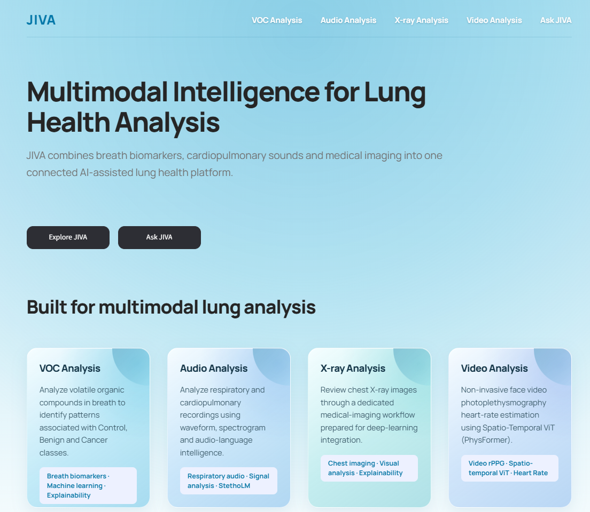

# JIVA - Multimodal Intelligence for Lung Health Analysis

<p align="center">
  
</p>

**JIVA** is a multimodal AI platform for non-invasive pulmonary health screening. It brings together breath VOC gas-chromatography analysis, cardiopulmonary audio auscultation, chest radiograph inspection, facial-video rPPG vital signs, model explainability, model benchmarking, downloadable PDF reports, and a domain-restricted conversational assistant into a single Streamlit application.

🔗 **Live demo:** https://jiva-demonstration.streamlit.app

> ⚠️ Research prototype, not a certified medical device — outputs are for research and screening support only, not diagnosis.

---

## Why Multimodal

Pulmonary disease rarely announces itself through a single signal. JIVA screens across four complementary biological axes at once:

| Axis | Signal | Modality in JIVA |
|---|---|---|
| Metabolic | Altered volatile organic metabolites in exhaled breath | Breath VOC analysis |
| Acoustic | Wheezes, crackles, adventitious sounds | Cardiopulmonary audio |
| Radiological | Opacities, consolidations, structural changes | Chest X-ray |
| Hemodynamic | Autonomic / cardiopulmonary stress in blood-volume pulsations | Facial video rPPG |

## Modules

- **Breath VOC Analysis** - 27 GC-MS biomarkers → Bagging ensemble classifier (Benign / Cancer / Control) + MLP regressor for compound concentration, with SHAP explainability and a PDF report.
- **Cardiopulmonary Audio** - Upload a `.wav` recording to view waveform + FFT spectrogram and get an AI-assisted acoustic read (StethoLM / MedGemma-backed, with a deterministic rule-engine fallback).
- **Chest X-ray Analysis** - Upload a radiograph for dimension/intensity inspection and a triage-style read; architecture is integration-ready for a full ViT/DenseNet classifier with Grad-CAM.
- **Video / Vital Signs (rPPG)** - Upload a video or record 160 frames live; a Haar-cascade face tracker feeds a PhysFormer Spatio-Temporal Vision Transformer to estimate heart rate (BPM) and signal quality (SNR) via Welch PSD.
- **Model Performance Dashboard** - KPI cards, confusion matrix, and multiclass ROC-AUC curves for the VOC models.
- **Ask JIVA** - A project-grounded, multi-lingual conversational assistant (`bharatgenai/Param-1-2.9B-Instruct`) with guardrails that keep it scoped to JIVA and refuse diagnosis/prescription requests. Supports voice input for major Indian languages.
- **PDF Reports** - Every module can export an in-memory, ReportLab-generated clinical summary report.

## Tech Stack

| Layer | Technologies |
|---|---|
| App framework | Streamlit, HTML/CSS, vanilla JS |
| Classical ML | scikit-learn, SciPy, NumPy, pandas |
| Deep learning / CV | PyTorch, OpenCV, Pillow |
| Audio | librosa, soundfile |
| Generative AI | Hugging Face `transformers`, `accelerate`, `huggingface_hub` |
| Explainability | SHAP (KernelExplainer) |
| Reports | ReportLab |
| Speech | `SpeechRecognition` |

## Project Structure

```
JIVA/
├── streamlit_app.py        # Entry point, routing, navbar
├── run_pipeline.py         # Offline training/benchmarking pipeline
├── requirements.txt
├── pages/                  # home, voc_analysis, audio_analysis, xray_analysis, video_analysis
├── components/             # chatbot.py (Ask JIVA), jiva_knowledge.py (prompt/knowledge base)
├── models/                 # best_classifier.pkl, best_regressor.pkl, PhysFormer checkpoint, etc.
├── utils/                  # helpers, model_loader, pdf_report, video_processor
├── data/                   # lung_cancer.csv / .json / .txt (427-patient breath dataset)
├── outputs/                # EDA, classification/regression benchmarks, SHAP plots
├── docs/                   # Full technical documentation
└── .streamlit/secrets.toml.example
```

See [`docs/JIVA_COMPLETE_PROJECT_DOCUMENTATION.md`](docs/JIVA_COMPLETE_PROJECT_DOCUMENTATION.md) 

## Getting Started

**Requirements:** Python 3.10–3.11

```bash
# Clone the repository
git clone https://github.com/VHarichandana/JIVA.git
cd JIVA

# Create and activate a virtual environment
python -m venv .venv
source .venv/bin/activate        # Windows: .venv\Scripts\Activate.ps1

# Install dependencies
pip install --upgrade pip
pip install -r requirements.txt
```

Confirm model artifacts exist under `models/` (`best_classifier.pkl`, `best_regressor.pkl`, `preprocessing_pipeline.pkl`, `label_encoder.pkl`, `selected_features.pkl`, `Physformer_VIPL_fold1.pkl`), then run:

```bash
streamlit run streamlit_app.py
```

Open `http://localhost:8501` in a browser.

**Hardware notes**
CPU-only: an 8-core CPU with 16 GB RAM is enough for VOC and PhysFormer inference (< 4s).
For local LLM/VLM inference: a GPU with ≥ 12 GB VRAM is recommended; without one, JIVA falls back to lighter inspection engines.

## Model Inventory

| Model | Task | Notes |
|---|---|---|
| Bagging ensemble (100 trees) | VOC multiclass classification | ~80.2% accuracy, ~90.6% cancer-class recall |
| MLP regressor | VOC compound concentration (CH₂O) | MAE ≈ 0.4356 |
| PhysFormer | Facial-video rPPG heart rate | CPU inference < 3.8s |
| Conversational LLM | Ask JIVA assistant | Domain-restricted via prompt + keyword guards |
| Audio / X-ray assisted-read models | Acoustic and radiograph inspection | Falls back to deterministic rule engines when unavailable |

## Datasets

- Breath VOC dataset: 427 patients × 27 GC-MS biomarkers (`data/lung_cancer.csv`, `.json`, `.txt`).
- Sample media for testing other modules: `audio_sample.wav`, `audio_cough.wav`, `sample_x_ray.jpeg`.

## Limitations

- VOC readings are sensitive to environmental contaminants (ambient air, smoking, diet, oral hygiene); external validation is ongoing.
- Audio analysis is sensitive to background noise and microphone contact.
- X-ray analysis currently runs as inspection/triage, not full diagnostic classification.
- rPPG accuracy depends on stable lighting and minimal head motion.
- Ask JIVA is an assistive tool and may oversimplify complex clinical scenarios.

## Roadmap

- Multimodal late-fusion "Pulmonary Health Index" combining all four modalities.
- DenseNet-121 / ViT chest X-ray classifier with Grad-CAM, trained on NIH ChestX-ray14.
- Quantized on-device models (INT4 / GGUF / ONNX) for edge and mobile deployment.
- Continuous streaming rPPG (sliding-window, live monitoring).
- FHIR/EHR export for structured findings.
