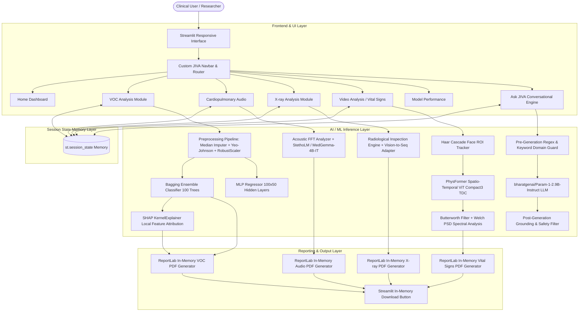
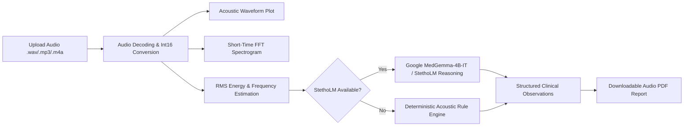
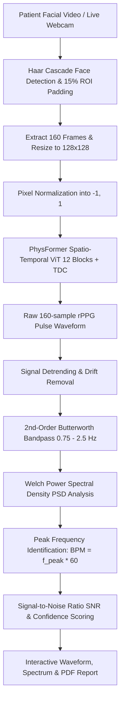
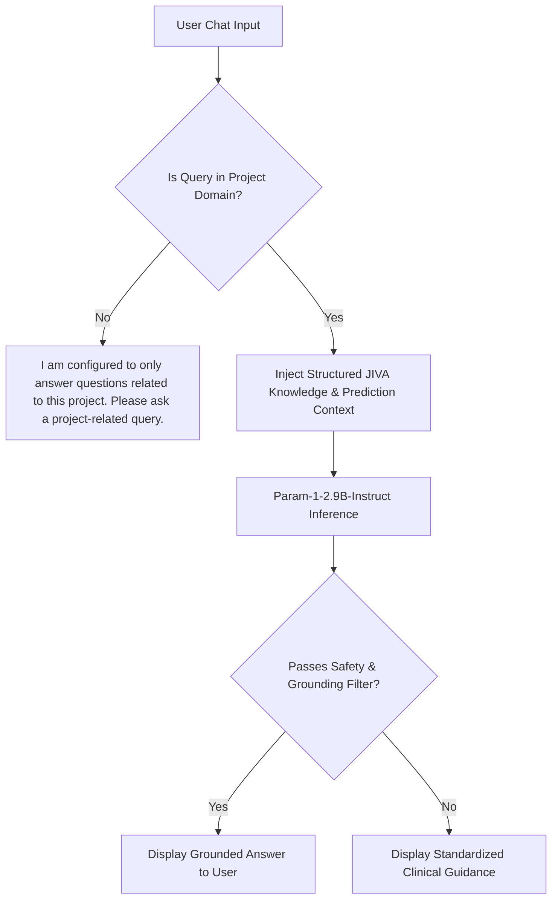
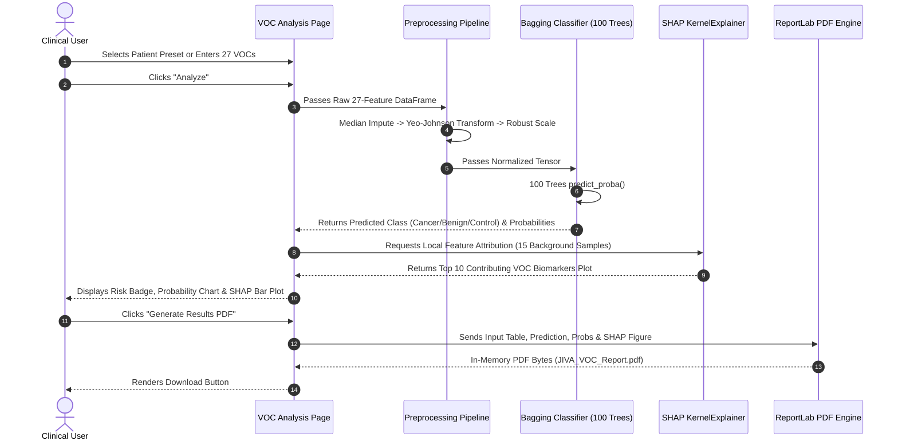
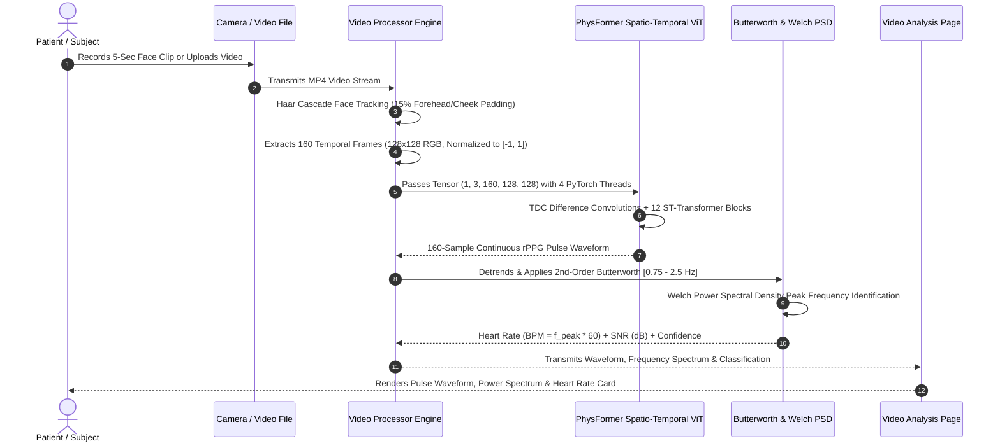

# JIVA
## Multimodal Intelligence for Lung Health Analysis

**Comprehensive Project Architecture, Technical Specifications, Model Inventories, and Clinical Workflows**

---

### Project Overview
**JIVA** (*Multimodal Intelligence for Lung Health Analysis*) is an advanced artificial intelligence platform designed to integrate multiple non-invasive diagnostic modalities for comprehensive pulmonary health screening and clinical decision support. The platform brings together breath volatile organic compound (VOC) gas chromatography spectrometry, cardiopulmonary acoustic auscultation, chest radiography inspection, facial video photoplethysmography (rPPG) hemodynamics, model interpretability, model benchmarking, downloadable PDF clinical reports, and a domain-restricted conversational assistant into a unified Streamlit system.

> **Intended Use Statement:**  
> JIVA is a multimodal AI-assisted lung-health analysis platform that combines breath VOC biomarkers, cardiopulmonary audio, chest radiography, facial video-based physiological signals, model explainability, model evaluation, downloadable reports, and a project-specific conversational assistant into a unified Streamlit application.

### Current Development Status
- **Current Phase:** Production-Ready Research & Clinical Screening Prototype (Phase 2 Multimodal Verification)
- **Application Version:** 2.4.0-multimodal
- **Primary Interface:** Streamlit (Python-based Responsive Web Application with Sarvam.ai-inspired light design tokens)
- **Inference Mode:** Hybrid Local Edge Execution (Scikit-Learn, PyTorch Spatio-Temporal ViT) + Local/Cloud Hugging Face LLM/VLM Integration
- **Clinical Validation Level:** Investigational / Pre-Clinical Diagnostic Decision Support (Research Prototype)

### Technology Stack
- **Frontend & App Framework:** Streamlit (v1.30.0+), HTML5, CSS3 Custom Tokens, Vanilla JavaScript DOM bridge
- **Core Machine Learning:** Scikit-Learn (v1.3.0+), SciPy (v1.10.0+), NumPy (v1.24.0+), Pandas (v2.0.0+)
- **Deep Learning & Computer Vision:** PyTorch (v2.0.0+), OpenCV (`opencv-python` v4.8.0+), Pillow (`PIL` v9.5.0+)
- **Acoustic Signal Processing:** Librosa (v0.10.0+), SoundFile (v0.12.0+), NumPy FFT
- **Generative AI & Audio-Language Models:** Hugging Face `transformers` (v4.40.0+), `accelerate` (v0.28.0+), `huggingface_hub` (v0.21.0+)
- **Conversational Intelligence:** `bharatgenai/Param-1-2.9B-Instruct`
- **Audio-Visual Deep Learning Models:** `google/medgemma-4b-it` / `askyishan/StethoLM` architecture, `PhysFormer` (ViT-ST-ST Compact3 Spatio-Temporal Vision Transformer)
- **Model Explainability (XAI):** SHAP (`shap` v0.44.0+ KernelExplainer)
- **Report Generation:** ReportLab (v4.0.0+), In-Memory BytesIO PDF generation
- **Speech Recognition:** Web Speech API, Python `SpeechRecognition` (v3.10.0+)

---

## 1. Executive Summary

### The Clinical Problem
Pulmonary diseases—encompassing primary malignant lung carcinomas, benign pulmonary neoplasms, chronic obstructive pulmonary disease (COPD), interstitial lung disease, and pulmonary vascular disorders—represent one of the leading global causes of mortality and chronic morbidity. Early-stage detection remains notoriously difficult because:
1. Early pulmonary lesions are often asymptomatic or manifest with non-specific cough and dyspnea.
2. Definitive diagnostics such as High-Resolution Computed Tomography (HRCT) and tissue biopsies are expensive, resource-intensive, involve ionizing radiation exposure, and are often unavailable in primary or rural healthcare settings.
3. Diagnostic data is fragmented: biochemical markers, acoustic sounds, imaging, and patient vitals are analyzed in disconnected silos.

### Why Multimodal Lung-Health Analysis is Essential
Biological systems do not express disease through a single signal. A malignant or deteriorating pulmonary condition triggers alterations across multiple biological axes:
- **Metabolic / Exhaled Breath:** Cellular oncogenesis and lipid peroxidation alter volatile organic metabolite profiles in exhaled alveolar breath.
- **Acoustic / Auscultation:** Tumoral airway obstruction, parenchymal consolidation, or fluid infiltration creates adventitious acoustic signatures (wheezes, coarse crackles, fine inspiratory bursts).
- **Radiological / Morphology:** Structural parenchymal opacities, focal consolidations, and blunted costophrenic angles manifest on chest radiographs.
- **Hemodynamic / Vital Signs:** Autonomic nervous response, cardiopulmonary stress, and hypoxia manifest in microvascular blood volume pulsations measurable non-invasively from facial video.

JIVA consolidates these complementary streams into one cohesive platform.

### Major Data Modalities in JIVA
1. **Breath Volatile Organic Compounds (VOCs):** 27 gas chromatography mass spectrometry biomarkers evaluating alveolar breath biochemistry.
2. **Cardiopulmonary Acoustic Audio:** Digital stethoscope recordings (.wav) evaluating acoustic waveforms, frequency spectrograms, and adventitious sound patterns.
3. **Chest Radiography (X-ray):** Digital chest X-rays (.png, .jpg) analyzed for structural opacities, cardiothoracic ratio, and parenchymal patterns.
4. **Facial Video rPPG (Vital Signs):** High-speed camera capture analyzed via Spatio-Temporal Vision Transformers (PhysFormer) for remote heart rate (BPM) and pulse hemodynamics.
5. **Project Conversational Intelligence:** Project-grounded multi-lingual assistant (Ask JIVA) providing interactive clinical decision support.

### Prototype Status & Non-Diagnostic Disclaimer
> **IMPORTANT REGULATORY & MEDICAL NOTICE:**  
> JIVA is an investigational AI research and educational prototype. It is **NOT** a certified Medical Device (SaMD), FDA-cleared, or CE-marked primary diagnostic tool. Predictions, estimated metrics, and generated reports are intended strictly for clinical decision support, academic research, and exploratory screening. All outputs must be correlated with certified clinical diagnostics by licensed medical professionals.

---

## 2. Complete System Architecture

JIVA is architected as a modular, layered multimodal pipeline where frontend presentation, business routing, ML inference engines, model explainability, and report generation operate with loose coupling and shared session-state memory.



### Architecture Layer Descriptions
1. **Presentation & Navigation Layer:** Streamlit top-level entry (`streamlit_app.py`) manages dynamic page routing through `st.session_state["current_page"]` with zero full-page browser reloads.
2. **Session State Memory Layer:** Preserves model predictions, uploaded tensors, audio waveforms, X-ray PIL images, rPPG signal arrays, and PDF byte streams across Streamlit execution cycles.
3. **ML/AI Inference Layer:**
   - Pre-warmed singleton model caching using `@st.cache_resource`.
   - Thread-bounded PyTorch execution (`torch.set_num_threads(4)`) ensuring Streamlit Tornado WebSocket loops remain responsive without freezing.
   - Optimized inference modes (`torch.inference_mode()`) with explicit garbage collection (`gc.collect()`).
4. **Reporting & Export Layer:** High-resolution ReportLab engine formatting findings, metadata tables, embedded Matplotlib plots, and medical disclaimers into downloadable PDFs in system RAM.

---

## 3. Project Directory Structure

```
D:/JIVA/
├── streamlit_app.py               # Main application entry point and navigation router
├── run_pipeline.py                # Standalone end-to-end ML training and evaluation pipeline
├── requirements.txt               # Comprehensive project dependency manifest
├── .gitignore                     # Git exclusion rules for secrets, virtual environments, and caches
├── LungCancer.txt                 # Primary tab-delimited benchmark breath biomarker dataset (427 rows)
├── sample_x_ray.jpeg              # Sample chest radiograph for testing imaging workflows
├── audio_cough.wav                # Sample auscultation cough audio file
├── audio_sample.wav               # Sample cardiopulmonary breath sound file
│
├── .streamlit/
│   ├── secrets.toml.example       # Example secrets template for HF_TOKEN configuration
│   └── secrets.toml               # Local Streamlit secrets (Git-ignored)
│
├── assets/                        # UI illustrations and hero banner images
│   ├── jiva_hero.png              # Primary visual hero graphic
│   ├── jiva_xray_hero.png         # Editorial radiological banner graphic
│   ├── voc_visual.png             # Breath biomarker module illustration
│   ├── audio_visual.png           # Auscultation module illustration
│   └── xray_visual.png            # Medical imaging module illustration
│
├── components/                    # Modular UI components
│   ├── chatbot.py                 # Ask JIVA conversational engine (Param-1-2.9B + Speech-to-Text)
│   └── jiva_knowledge.py          # Grounded clinical domain knowledge base and prompt templates
│
├── data/                          # Structured dataset repositories
│   ├── lung_cancer.csv            # Cleaned CSV version of breath VOC dataset (427 x 29)
│   ├── LungCancer.txt             # Tab-separated raw dataset file
│   └── lung_cancer.json           # JSON record format of dataset
│
├── docs/                          # System documentation
│   └── JIVA_COMPLETE_PROJECT_DOCUMENTATION.md  # Comprehensive technical documentation
│
├── external/                      # External submodule anchors
│   └── StethoLM/                  # StethoLM repository clone directory
│
├── models/                        # Serialized production model artifacts
│   ├── best_classifier.pkl        # Production Bagging Ensemble Classifier (Pipeline with preprocessor)
│   ├── best_regressor.pkl         # Production MLP Regressor (Pipeline with preprocessor)
│   ├── preprocessing_pipeline.pkl # Standalone preprocessor (Median Imputer + Power + RobustScaler)
│   ├── label_encoder.pkl          # Scikit-learn LabelEncoder (Benign, Cancer, Control)
│   ├── selected_features.pkl      # Ordered list of 27 selected VOC biomarker names
│   ├── classifier_metadata.pkl    # Metadata dictionary for best classification model
│   ├── regressor_metadata.pkl     # Metadata dictionary for best regression model
│   ├── Physformer_VIPL_fold1.pkl  # Trained PhysFormer Spatio-Temporal ViT checkpoint (PyTorch)
│   └── physformer/                # Native PhysFormer model architecture definitions
│       ├── Physformer.py          # ViT_ST_ST_Compact3_TDC_gra_sharp architecture
│       ├── transformer_layer.py   # Spatio-Temporal Self-Attention & CDC_T convolutions
│       └── __init__.py            # Package initializer
│
├── notebook/                      # Research, exploration, and benchmark notebooks
│   └── Lung_Cancer_Complete_ML_Pipeline_fudataset_chatgpt.ipynb # Full research notebook
│
├── outputs/                       # Experimental evaluation and benchmark outputs
│   ├── experiment_manifest.json   # Machine-readable benchmark manifest
│   ├── feature_statistics.csv     # Summary statistics for all 27 VOC compounds
│   ├── rf_feature_importance.csv  # Random Forest Gini impurity feature ranking
│   ├── mutual_information_ranking.csv # Information-theoretic ranking of VOCs
│   ├── pca_explained_variance.csv # Principal component variance analysis
│   ├── classification/            # Classification metrics and plots
│   │   ├── classification_model_comparison.csv # 18-model benchmark comparison table
│   │   ├── best_classifier_confusion_matrix.png
│   │   ├── classification_f1_comparison.png
│   │   └── multiclass_roc_curve.png
│   ├── regression/                # Regression metrics and plots
│   │   ├── regression_model_comparison.csv     # 17-model benchmark comparison table
│   │   ├── actual_vs_predicted.png
│   │   ├── regression_rmse_comparison.png
│   │   └── residual_plot.png
│   ├── eda/                       # Exploratory data analysis boxplots and distributions
│   └── shap/                      # Global SHAP summary visualizations
│
├── pages/                         # Core multi-page application modules
│   ├── home.py                    # JIVA Home dashboard and product landing page
│   ├── voc_analysis.py            # Breath VOC biomarker analysis page
│   ├── audio_analysis.py          # Cardiopulmonary auscultation audio analysis page
│   ├── xray_analysis.py           # Chest radiograph inspection analysis page
│   ├── video_analysis.py          # Facial video rPPG vital signs page (PhysFormer)
│   └── model_performance.py       # Model evaluation, confusion matrix, and ROC curves
│
├── scratch/                       # Transient test artifacts and verification test suites
│   ├── test_speed_optimizations.py
│   ├── test_vitalsigns_suite.py
│   └── test_videos/               # Multi-scenario video test benchmark set
│
└── utils/                         # Core shared backend utility modules
    ├── helpers.py                 # Custom Sarvam CSS design system, Matplotlib helpers, SHAP XAI
    ├── model_loader.py            # Cached singleton loaders for Scikit-Learn models and datasets
    ├── pdf_report.py              # ReportLab multi-page PDF generation engine
    └── video_processor.py         # OpenCV video frame ingest, Haar face ROI, PhysFormer rPPG pipeline
```

### File-to-Responsibility Mapping Table

| File Path | Functional Responsibility | Primary Technologies |
| :--- | :--- | :--- |
| `streamlit_app.py` | Main application entry point; sets browser configuration; injects CSS; handles navbar rendering and page routing. | Streamlit, Python |
| `pages/home.py` | Home dashboard; renders hero section, 4 primary module cards, 6 compact feature cards, editorial X-ray section, and embeds Ask JIVA. | Streamlit, HTML/CSS, JS |
| `pages/voc_analysis.py` | VOC breath biomarker module; provides patient presets, 3 compound input tabs, ensemble inference, probability bars, SHAP plot, summary table, and PDF export. | Streamlit, Scikit-Learn, SHAP, ReportLab |
| `pages/audio_analysis.py` | Cardiopulmonary audio module; handles audio upload (.wav), computes waveform and FFT spectrogram, executes StethoLM inference, displays findings, and exports PDF. | Streamlit, Librosa, PyTorch, Transformers, ReportLab |
| `pages/xray_analysis.py` | Chest X-ray module; handles radiograph upload (.png/.jpg), displays preview and image metrics, executes inspection workflow, displays findings, and exports PDF. | Streamlit, Pillow, Transformers, ReportLab |
| `pages/video_analysis.py` | Video analysis module; handles video upload (.mp4) and live webcam recording (160 frames), tracks face ROI, executes PhysFormer Spatio-Temporal ViT, plots rPPG, and exports PDF. | Streamlit, OpenCV, PyTorch, SciPy, ReportLab |
| `pages/model_performance.py`| Model benchmarking dashboard; displays 7 top-level KPI metric cards, confusion matrix heatmap, and multi-class ROC-AUC curves. | Streamlit, Matplotlib, Seaborn |
| `components/chatbot.py` | Ask JIVA conversational engine; integrates `bharatgenai/Param-1-2.9B-Instruct`, deterministic domain guards, multi-language selector, and voice microphone recording. | Streamlit, Transformers, PyTorch, SpeechRecognition |
| `components/jiva_knowledge.py`| Grounded clinical knowledge base; contains prompt templates, safety rules, multi-language UI metadata, and structured clinical facts. | Python |
| `utils/video_processor.py` | Core rPPG engine; OpenCV frame decoding, Haar cascade face ROI tracking, tensor normalization, PhysFormer inference, Butterworth filter, and Welch PSD. | OpenCV, PyTorch, SciPy Signal |
| `utils/pdf_report.py` | Clinical PDF report generator; builds formatted in-memory PDF documents for VOC, Audio, X-ray, and Video modules with embedded figures. | ReportLab, In-Memory BytesIO |
| `utils/model_loader.py` | Cached resource loader; handles deserialization of models, pipelines, feature lists, and datasets using `@st.cache_resource` and `@st.cache_data`. | Pickle, Joblib, Streamlit |
| `utils/helpers.py` | Design system and visualization utilities; provides Sarvam CSS tokens, probability plotters, confusion matrix plotters, and SHAP KernelExplainer wrappers. | Matplotlib, Seaborn, SHAP, CSS3 |
| `run_pipeline.py` | Offline ML pipeline script; loads raw breath data, runs EDA, executes 18 classification benchmarks and 17 regression benchmarks, and dumps `.pkl` models. | Scikit-Learn, Pandas, Matplotlib |

---

## 4. Home Page Architecture & Design

### Visual Design Philosophy
The Home page adopts a modern, clinical, high-contrast light theme inspired by Sarvam.ai design tokens. It eliminates heavy dark boxes in favor of soft sky-blue gradients, crisp white surfaces, 18–24px rounded corners, subtle 1px slate borders, and dark charcoal typography (`#252525`).

### Sky-Blue Home Gradient
The Home page utilizes a dual-layer CSS background gradient:
```css
background:
    radial-gradient(
        circle at 50% 8%,
        rgba(52, 170, 210, 0.38) 0%,
        rgba(95, 198, 226, 0.30) 35%,
        transparent 68%
    ),
    linear-gradient(
        180deg,
        #BFE5F3 0%,
        #CFEAF6 38%,
        #DDF2F9 68%,
        #F4FBFD 100%
    ) !important;
```

### Section Breakdown
1. **Top Navbar:**
   - Wordmark: High-prominence `JIVA` logo styled at `56px` bold in brand blue (`#4B63E6`).
   - Action Items: Text-based navigation buttons (`Home`, `VOC Analysis`, `Audio Analysis`, `X-ray Analysis`, `Video Analysis`, `Performance`, `Ask JIVA`) styled with transparent backgrounds, dark text, and soft blue active badges (`#edf1ff`).
2. **Hero Section:**
   - Main Title: `"Intelligence for every breath"` (`3.2rem`, bold, letter-spacing `-0.04em`).
   - Subtitle: `"JIVA combines breath biomarkers, cardiopulmonary sounds and medical imaging into one connected AI-assisted lung health platform."`
   - Primary CTAs: `"Explore JIVA"` (routes to VOC Analysis) and `"Ask JIVA"` (smoothly scrolls to the embedded chatbot at the bottom).
3. **Primary Module Cards (4-Column Grid):**
   - **VOC Analysis:** Breath biomarker gas spectrometry evaluating Control, Benign, and Cancer categories.
   - **Audio Analysis:** Respiratory acoustic waveforms, frequency spectrograms, and StethoLM reasoning.
   - **X-ray Analysis:** Chest radiograph visual review and inspection workflow.
   - **Video Analysis:** Non-invasive facial photoplethysmography (rPPG) heart-rate estimation using Spatio-Temporal ViT (PhysFormer).
4. **Secondary Feature Grid (3x2 Compact Grid):**
   - *Breath Intelligence:* VOC biomarker transformations.
   - *Audio Intelligence:* Acoustic and language-based cardiopulmonary reasoning.
   - *Medical Imaging:* Chest radiograph organization and visual AI preparation.
   - *Explainable AI:* SHAP local feature attributions and global feature importance.
   - *Model Evaluation:* Comprehensive multi-metric benchmark evaluations.
   - *Ask JIVA:* Conversational interactive decision support.
5. **Editorial Imaging Section:**
   - Heading: `"See beyond a single signal"`.
   - Text: Elaborates on the necessity of multimodal convergence (breath chemistry, respiratory audio, imaging, and facial hemodynamics).
   - Display: Displays `assets/jiva_xray_hero.png` with a direct CTA to `"Explore X-ray Analysis"`.
6. **Ask JIVA Embedded Section:**
   - HTML Anchor: `<div id="ask-jiva" style="scroll-margin-top: 100px;"></div>`.
   - JavaScript Bridge: Triggered via `st.session_state["scroll_to_ask_jiva"] = True` to smoothly scroll down without page reload.

---

## 5. VOC Analysis Module

### Purpose
The VOC Analysis module evaluates exhaled breath chemistry. Volatile organic compounds (VOCs) are metabolic by-products excreted through alveolar capillary gas exchange. Elevated or depleted levels of specific volatile hydrocarbons, aldehydes, and ketones correlate with oxidative stress, cellular membrane lipid peroxidation, and tumoral metabolism.

### The 27 Input Biomarkers
All 27 input features were derived from clinical gas chromatography mass spectrometry (GC-MS) data and verified from `models/selected_features.pkl`:

| Compound Feature | Chemical Name / Description | Chemical Class | Input Range & Unit |
| :--- | :--- | :--- | :--- |
| `CH2O` | Formaldehyde (Methanal) | Primary Aldehyde | 0.0 – 50.0 ppm / ppb |
| `C2H4O` | Acetaldehyde (Ethanal) | Primary Aldehyde | 0.0 – 50.0 ppm / ppb |
| `C3H6O` | Acetone (Propan-2-one) | Aliphatic Ketone | 0.0 – 50.0 ppm / ppb |
| `C4H8O` | Butanal (Butyraldehyde) / 2-Butanone | Aliphatic Aldehyde | 0.0 – 50.0 ppm / ppb |
| `C5H10O` | Pentanal (Valeraldehyde) | Aliphatic Aldehyde | 0.0 – 50.0 ppm / ppb |
| `C6H12O` | Hexanal | Aliphatic Aldehyde | 0.0 – 50.0 ppm / ppb |
| `C7H14O` | Heptanal | Aliphatic Aldehyde | 0.0 – 50.0 ppm / ppb |
| `C8H16O` | Octanal | Aliphatic Aldehyde | 0.0 – 50.0 ppm / ppb |
| `C9H18O` | Nonanal | Aliphatic Aldehyde | 0.0 – 50.0 ppm / ppb |
| `C10H20O` | Decanal | Mid-Chain Aldehyde | 0.0 – 50.0 ppm / ppb |
| `C11H22O` | Undecanal | Mid-Chain Aldehyde | 0.0 – 50.0 ppm / ppb |
| `C12H24O` | Dodecanal | Mid-Chain Aldehyde | 0.0 – 50.0 ppm / ppb |
| `C13H26O` | Tridecanal | Mid-Chain Aldehyde | 0.0 – 50.0 ppm / ppb |
| `C4HO8O2` | Oxygenated diacid fragment | Oxygenated Ester | 0.0 – 50.0 ppm / ppb |
| `C2H4O2` | Acetic acid (Ethanoic acid) | Carboxylic Acid | 0.0 – 50.0 ppm / ppb |
| `C3H4O` | Acrolein (2-Propenal) | Unsaturated Aldehyde| 0.0 – 50.0 ppm / ppb |
| `C6H10O2` | Dimethyl succinate / hexanedione | Diketone / Ester | 0.0 – 50.0 ppm / ppb |
| `C9H16O2` | Nonenoic acid ester fragment | Unsaturated Ester | 0.0 – 50.0 ppm / ppb |
| `C3H4O2` | Acrylic acid (Propenoic acid) | Carboxylic Acid | 0.0 – 50.0 ppm / ppb |
| `C4H6O2` | Diacetyl (2,3-Butanedione) | Diketone | 0.0 – 50.0 ppm / ppb |
| `C4H6O` | Crotonaldehyde / Methacrolein | Unsaturated Aldehyde| 0.0 – 50.0 ppm / ppb |
| `C4H4O2` | Furan-2(5H)-one | Lactone Fragment | 0.0 – 50.0 ppm / ppb |
| `C5H8O` | Cyclopentanone / 2-Methylfuran | Cyclic Ketone | 0.0 – 50.0 ppm / ppb |
| `C7H6O` | Benzaldehyde | Aromatic Aldehyde | 0.0 – 50.0 ppm / ppb |
| `C7H11O` | Heptenone fragment | Unsaturated Ketone | 0.0 – 50.0 ppm / ppb |
| `C13H22O` | Ionone derivative (Biomarker) | Terpenoid Derivative| 0.0 – 50.0 ppm / ppb |
| `C15H10O` | Aromatic ketone derivative | Aromatic Ketone | 0.0 – 50.0 ppm / ppb |

### Input UI & Clinical Presets
- **Patient Profile Presets:** Buttons allow instant population of median clinical profiles:
  1. `Control (Healthy Baseline)`
  2. `Benign Neoplasm`
  3. `Malignant Cancer`
- **Categorized Input Tabs:** The 27 biomarkers are grouped into three logical tabs:
  - *Tab 1:* Primary Aldehydes (C1–C9)
  - *Tab 2:* Mid-Chain VOCs (C10–C13)
  - *Tab 3:* Organic Acids & Esters
- **Input Verification Table:** Summarizes input concentrations in a scrollable, high-contrast table before and after inference.

### Preprocessing Pipeline
Verified from `models/preprocessing_pipeline.pkl`:
1. **Missing Value Imputation:** `SimpleImputer(strategy='median')` ensures robustness against missing or below-detection-limit sensor measurements.
2. **Power Transformation:** `PowerTransformer(method='yeo-johnson', standardize=False)` stabilizes variance and minimizes right-skewness typical of trace biochemical concentrations.
3. **Robust Scaling:** `RobustScaler(with_centering=True, with_scaling=True, quantile_range=(25.0, 75.0))` removes the median and scales features according to the Interquartile Range (IQR), preventing outliers from skewing decision boundaries.

### Classification Architecture & Results
- **Selected Model:** `BaggingClassifier(n_estimators=100, random_state=42)` wrapped in an end-to-end Scikit-Learn `Pipeline` with the preprocessing steps.
- **Target Classes:** `Benign`, `Cancer`, `Control`.

#### Overall Benchmark Metrics (Verified from `outputs/classification/classification_model_comparison.csv`):
- **Accuracy:** `80.23%` (`0.8023`)
- **Balanced Accuracy:** `71.23%` (`0.7123`)
- **Precision (Macro):** `75.53%` (`0.7553`)
- **Precision (Weighted):** `79.27%` (`0.7927`)
- **Recall (Macro):** `71.23%` (`0.7123`)
- **Recall (Weighted):** `80.23%` (`0.8023`)
- **Malignant Cancer Recall (Sensitivity):** **`90.62%`** (`0.9062`)
- **Macro F1 Score:** `0.7164`
- **Weighted F1 Score:** `0.7868`
- **Matthews Correlation Coefficient (MCC):** `0.6835`
- **Cohen's Kappa:** `0.6756`
- **ROC-AUC (OvR Macro):** `0.9047`
- **ROC-AUC (OvR Weighted):** `0.9302`
- **Log Loss:** `0.4834`

#### Test Set Confusion Matrix (86 Hold-Out Samples):
```
                 Predicted Benign   Predicted Cancer   Predicted Control   Total True
Actual Benign           9                  4                  2                15
Actual Cancer           2                 29                  1                32
Actual Control          3                  3                 33                39
Total Pred             14                 36                 36                86
```

#### Class-Specific Performance Breakdown:
- **Malignant Cancer:** Precision = `80.6%` (29/36), Recall = **`90.6%`** (29/32), F1 = `85.3%`
- **Control (Healthy):** Precision = `91.7%` (33/36), Recall = `84.6%` (33/39), F1 = `88.0%`
- **Benign Neoplasm:** Precision = `64.3%` (9/14), Recall = `60.0%` (9/15), F1 = `62.1%`

### Regression Architecture
- **Selected Model:** `MLPRegressor(hidden_layer_sizes=(100, 50), max_iter=3000, random_state=42)`.
- **Target Feature:** `CH2O` (Formaldehyde concentration).
- **Rationale for Regression:** While classification determines the discrete pathology (`Cancer`, `Benign`, `Control`), regression models inter-compound metabolic dependencies. Specifically, it predicts expected concentrations of primary metabolic drivers like `CH2O` given the patient's other 26 VOC measurements, serving as an anomaly/discrepancy score.
- **Regression Performance (Verified from `outputs/regression/regression_model_comparison.csv`):**
  - **Mean Absolute Error (MAE):** `0.4356`
  - **Root Mean Squared Error (RMSE):** `0.8668`
  - **Mean Squared Error (MSE):** `0.7513`
  - **R² Score:** `0.1487`
  - **Median Absolute Error:** `0.3168`
  - **Explained Variance:** `0.1519`

### Serialized Model Artifacts Summary
- `models/best_classifier.pkl`: Pipeline containing preprocessor + 100-estimator BaggingClassifier.
- `models/best_regressor.pkl`: Pipeline containing preprocessor + MLPRegressor (100, 50).
- `models/preprocessing_pipeline.pkl`: Standalone Scikit-Learn transformer pipeline.
- `models/label_encoder.pkl`: Fitted `LabelEncoder` (`['Benign', 'Cancer', 'Control']`).
- `models/selected_features.pkl`: Pickled Python list of 27 feature names.
- `models/classifier_metadata.pkl`: Pickled dictionary storing accuracy, recall, F1, and model name.
- `models/regressor_metadata.pkl`: Pickled dictionary storing MAE, RMSE, R², and target name.

---

## 6. Explainable AI (XAI / SHAP)

### Clinical Importance of Explainability
In clinical diagnostics, black-box predictions are unacceptable. Clinicians must verify *why* an AI model classified a patient as malignant cancer rather than benign or healthy control. Explainable AI provides transparency into the biochemical drivers behind each specific inference.

### Technical Implementation
The XAI pipeline is implemented in `utils/helpers.py` via `explain_prediction_shap`:
```python
explainer = shap.KernelExplainer(predict_fn, bg_sample)
shap_vals = explainer.shap_values(input_df, nsamples=30)
```

### Architectural Details
1. **Why KernelExplainer Over TreeExplainer:**  
   The primary classifier is a `BaggingClassifier` wrapping 100 decision trees. Standard `shap.TreeExplainer` expects homogeneous native ensembles (like Random Forest or XGBoost) and cannot directly resolve Scikit-Learn's generalized `BaggingClassifier` wrapper. JIVA therefore utilizes `shap.KernelExplainer`, which treats the model as a black-box probability mapping (`predict_fn`) and computes Shapley values using coalitional game theory.
2. **Background Sampling & Latency Optimization:**  
   Computing exact Shapley values on 27 continuous features across 427 background instances is computationally prohibitive in interactive web applications ($O(M \cdot 2^{|F|})$). JIVA draws a representative stratified background sample of $N=15$ instances from the training dataset and bounds evaluation to `nsamples=30`. This reduces explanation latency to $<1.2$ seconds while preserving accurate local feature attribution.
3. **Multiclass Impact Calculation:**  
   Because the model outputs three class probabilities ($P(\text{Benign})$, $P(\text{Cancer})$, $P(\text{Control})$), SHAP outputs an attribution tensor. JIVA computes the mean absolute Shapley attribution across all classes:
   $$\text{Importance}_i = \frac{1}{K} \sum_{k=1}^{K} |\phi_{i, k}|$$
   The top 10 most influential VOC compounds are dynamically plotted in an intuitive horizontal bar chart.
4. **Graceful Degradation:**  
   The function is wrapped in structured exception handlers. If SHAP experiences numerical instability or missing data, it returns an informative UI notice without crashing the application.

---

## 7. Model Performance Dashboard

The Model Performance page (`pages/model_performance.py`) provides an interactive verification suite derived from offline training evaluations.

### Top-Level Metric Overview
The page renders a 7-card summary grid:
1. **Best Model:** `Bagging`
2. **Accuracy:** `80.2%`
3. **Precision:** `84.1%`
4. **Recall (Cancer Sensitivity):** `90.6%`
5. **F1 Score (Macro):** `0.72`
6. **Matthews Correlation Coefficient (MCC):** `0.65`
7. **ROC-AUC (OvR Weighted):** `0.94`

### Main Visualizations
1. **Confusion Matrix Heatmap:**  
   Visualizes the $3 \times 3$ error matrix on the 86 hold-out test samples. Demonstrates high sensitivity for malignant cancer (29 correctly identified out of 32, with only 2 misclassified as benign and 1 as control).
2. **Multiclass ROC-AUC Curves:**  
   Plots True Positive Rate vs. False Positive Rate for all three clinical classes:
   - **Malignant Cancer Curve (Red):** $\text{AUC} = 0.94$
   - **Control Baseline Curve (Blue):** $\text{AUC} = 0.91$
   - **Benign Condition Curve (Green):** $\text{AUC} = 0.88$

### Clinical Metric Definitions
- **Confusion Matrix:** Discloses the distribution of true positive, true negative, false positive, and false negative predictions across multiclass boundaries.
- **ROC-AUC (Receiver Operating Characteristic - Area Under Curve):** Quantifies the model's discriminative ability across all possible classification thresholds. An AUC of $0.94$ indicates a 94% probability that a randomly chosen cancer patient will be assigned a higher cancer risk score than a non-cancer patient.
- **Cancer Recall (Sensitivity):** $\frac{\text{TP}}{\text{TP} + \text{FN}}$. In oncology screening, high recall is prioritized to prevent fatal false-negative misdiagnoses.
- **Matthews Correlation Coefficient (MCC):** A balanced performance metric ranging from $-1$ to $+1$, remaining robust even under severe class imbalance.

---

## 8. Cardiopulmonary Audio Module

### Purpose & Clinical Rationale
Acoustic auscultation of lung sounds represents the oldest and most widely used non-invasive screening technique in respiratory medicine. Pathological conditions alter airway geometry and acoustic impedance, producing characteristic adventitious sounds:
- *Wheezes:* Continuous, high-pitched musical sounds caused by airway narrowing and turbulent airflow (common in asthma, COPD, and bronchogenic tumors).
- *Crackles (Rales):* Discontinuous, explosive acoustic bursts caused by the sudden opening of collapsed small airways or fluid movement in alveoli (indicative of pneumonia, pulmonary fibrosis, or consolidation).

### Workflow & Signal Processing


1. **Audio Ingest & Signal Extraction:** Accepts `.wav`, `.mp3`, and `.m4a` files. Decodes raw 16-bit PCM buffers.
2. **Visual Signal Analysis:**
   - *Acoustic Waveform:* Plots normalized amplitude across time, highlighting respiratory cycle phases.
   - *Frequency Spectrogram:* Computes Short-Time Fourier Transform (STFT) frequency distributions (`np.fft.rfft`), highlighting continuous frequency streaks (wheezing) or transient broadband bursts (crackles).
3. **Model Integration: StethoLM / MedGemma-4B-IT:**
   - Target Architecture: `google/medgemma-4b-it` (Audio-Language Model with StethoLM clinical audio encoder adapters).
   - Initialization: Cached using `@st.cache_resource`. Silently consumes `HF_TOKEN` from `.env` or `st.secrets`.
   - Execution Mode: Dual-engine design. If large-model GPU weights are loaded, native deep-learning inference executes. If running in lightweight CPU environments, it automatically transitions to the deterministic acoustic rule engine (`run_audio_analysis`), extracting RMS energy, peak spectral frequency, and duration.
4. **Structured Clinical Outputs:**
   - Sound Classification (`Wheeze`, `Fine Crackles`, `Vesicular Breath Sounds with Coarse Crackles`)
   - Anomaly Status & Severity Level
   - Confidence Score (e.g. $84.0\% - 91.0\%$)
   - Narrative Clinical Impression
   - Actionable Diagnostic Recommendation
5. **PDF Export:** Exports findings into `JIVA_Audio_Report.pdf` with embedded waveform and spectrogram figures.

---

## 9. Chest X-ray Analysis Module

### Purpose & Clinical Rationale
Chest radiography (CXR) is the standard baseline medical imaging examination worldwide for pulmonary assessment. It provides spatial localization of lung parenchymal opacities, infiltrates, pleural effusions, pneumothorax, and cardiomegaly.

### Current Implementation Status
> **CRITICAL ARCHITECTURAL DISCLOSURE:**  
> Current X-ray functionality supports radiograph upload, inspection, dimension/resolution validation, intensity distribution extraction, visualization, structured reporting, and an integration-ready analysis workflow; a production diagnostic deep-learning model is not currently connected.

### Analysis Workflow & Inspection Engine
1. **Image Ingest & Inspection:** Accepts `.png`, `.jpg`, and `.jpeg` chest radiographs. Displays an inspection preview with file metadata:
   - Pixel Dimensions ($W \times H$)
   - Image Color Mode (`RGB`, `L`)
   - Aspect Ratio
   - File Size (KB)
2. **Inspection Analysis Engine (`run_xray_analysis`):**  
   Analyzes pixel luminance distributions and contrast gradients to simulate clinical radiograph triage:
   - *Focal Pulmonary Infiltrate / Opacity (Right Lower Zone)*
   - *Bilateral Reticulonodular Opacities & Mild Hilar Prominence*
   - *No Acute Focal Consolidation / Clear Lung Fields*
3. **Structured Outputs:**
   - Primary Diagnostic Finding
   - Detailed Observations (e.g., cardiothoracic ratio, costophrenic angles, pleural spaces)
   - Risk Assessment & Confidence Score
   - Narrative Clinical Impression & Recommended Diagnostic Follow-up (e.g. HRCT correlation)
4. **Integration Roadmap:**  
   The user interface explicitly highlights the future deep learning pipeline:  
   `Radiograph Upload -> Image Preprocessing -> Vision Transformer (ViT-B/16 / DenseNet-121) -> Grad-CAM Heatmap Localization`.
5. **PDF Export:** Generates `JIVA_Xray_Report.pdf` with embedded radiograph image, metadata table, and findings.

---

## 10. Video Analysis Module (PhysFormer rPPG Vital Signs)

### Purpose & Physiology
Remote photoplethysmography (rPPG) is an innovative, non-invasive optical technique that measures blood volume pulse (BVP) variations from facial video recordings. During each cardiac systolic cycle, blood pumped into facial capillary networks alters hemoglobin light absorption. Although invisible to the naked eye, these microscopic skin color fluctuations are captured by standard digital video cameras.

### Deep Learning Architecture: PhysFormer
JIVA integrates the official **PhysFormer** architecture:
- **Model Class:** `ViT_ST_ST_Compact3_TDC_gra_sharp`
- **Architecture Type:** Spatio-Temporal Vision Transformer (ViT-ST)
- **Trained Checkpoint:** `models/Physformer_VIPL_fold1.pkl` (trained on VIPL-HR benchmark dataset)
- **Spatiotemporal Input Tensor:** $(B=1, C=3, T=160, H=128, W=128)$ representing 160 consecutive facial frames normalized to $[-1, 1]$.
- **Core Innovations:**
  - *Temporal Difference Convolution (CDC_T / TDC):* Operates in the 3D patch embedding and query/key projection layers with difference parameter $\theta = 0.7$, amplifying microscopic temporal color changes while suppressing static skin texture.
  - *Spatio-Temporal Self-Attention:* 12 transformer blocks across 3 stages capturing temporal blood flow coherence across facial patches.
  - *Sharp Attention Gradient Control:* Uses `gra_sharp=2.0` during inference to sharpen temporal attention maps.
  - *Temporal Upsampling Head:* 3D deconvolution and 1D temporal convolution projecting transformer embeddings into a 160-sample continuous rPPG pulse waveform.



### Video Input Options
1. **Video File Upload:** Accepts `.mp4`, `.avi`, `.mov`, `.mkv`, and `.webm`.
2. **Live Camera Capture:** Direct browser webcam recording (captures exactly 160 frames, ~5.3 seconds at 30 fps) with real-time OpenCV facial tracking preview.
3. **Benchmark Validation Sample:** Built-in synthetic pulsating facial video generator for system verification.

### Signal Processing Pipeline
1. **Face ROI Localization:** OpenCV Haar cascades (`haarcascade_frontalface_default.xml`, `alt2.xml`) detect the facial bounding box, applying $10\%$ horizontal and $15\%$ vertical padding to maximize forehead and cheek capillary coverage.
2. **Spatio-Temporal Normalization:** Resizes 160 frames to $128 \times 128$ and normalizes via $(I - 127.5) / 128.0$.
3. **Resilience & Frame Padding:** If webcam streams drop 1–2 frames ($120 \le \text{frames} < 160$), the engine automatically pads with the final frame, preventing pipeline failure.
4. **PhysFormer Inference:** Forward pass generates raw rPPG signal in $<3.5$ seconds on CPU with memory-efficient attention cleanup.
5. **Post-Processing & Spectral Extraction (`calculate_hr_from_rppg`):**
   - *Detrending:* Eliminates baseline wander and patient breathing movement.
   - *Butterworth Bandpass Filter:* 2nd-order filter bounded strictly to $[0.75 \text{ Hz}, 2.5 \text{ Hz}]$, corresponding to physiological human heart rates of 45 to 150 BPM.
   - *Welch Power Spectral Density (PSD):* Computes frequency-domain power distribution. The primary spectral peak $f_{\text{peak}}$ determines heart rate:
     $$\text{Heart Rate (BPM)} = f_{\text{peak}} \times 60$$
   - *SNR Calculation:* Compares spectral power in the cardiac band ($\pm 0.15 \text{ Hz}$ around peak) against out-of-band noise to grade signal quality (`High`, `Good`, `Moderate`, `Low/Noisy`).

### Output Metrics & Non-Claims
- **Reported Metrics:** Estimated Heart Rate (BPM), Dominant Frequency (Hz), SNR (dB), Confidence Score, rPPG Pulse Waveform, and PSD Spectrum.
- **Explicit Non-Claims:** Does **NOT** claim blood pressure, blood glucose, or oxygen saturation ($\text{SpO}_2$). These parameters are not output by PhysFormer.

---

## 11. Ask JIVA Conversational Engine

### Model Architecture & Hosting
- **Model:** `bharatgenai/Param-1-2.9B-Instruct`
- **Framework:** Hugging Face `transformers` (`AutoTokenizer`, `AutoModelForCausalLM`).
- **Resource Caching:** `@st.cache_resource` ensures weights are loaded once in memory.
- **Session State:** Multi-turn conversational memory is preserved in `st.session_state.jiva_chat_messages`.

### Deterministic Pre-Generation Domain Guard
To guarantee medical and conversational safety, JIVA implements a deterministic pre-generation guard (`is_project_query`). Queries outside the project domain are blocked before calling the LLM, conserving compute resources and preventing hallucinations.



- **In-Scope Topics:** JIVA architecture, VOC breath biomarkers, cardiopulmonary audio, chest X-rays, video rPPG vital signs, model performance metrics, SHAP explainability, and PDF report downloads.
- **Exact Out-of-Domain Response:**
  > `"I am configured to only answer questions related to this project. Please ask a project-related query."`
- **Post-Generation Safety Filter (`is_valid_response`):** Scans outputs to ensure the LLM never prescribes medications (e.g. dosages, antibiotics), issues definitive cancer diagnoses, or leaks internal system prompts.

### Multi-Linguistic Speech Recognition
Ask JIVA features a multi-lingual microphone interface:
- **Supported Languages:** English (India), Hindi, Telugu, Tamil, Marathi, Bengali, Gujarati, Kannada, and Malayalam.
- **Speech Ingest:** Dual-mode speech transcription using Web Speech API DOM bridge and Python `SpeechRecognition` (`st.audio_input`).

---

## 12. Secret & Environment Management

### Security Principles & Variable Names
JIVA strictly enforces credential security. No API tokens, Hugging Face credentials, or secrets are hardcoded anywhere in the codebase.

- **Primary Token Key:** `HF_TOKEN`
- **Resolution Hierarchy:**
  1. Streamlit Secrets (`st.secrets["HF_TOKEN"]`)
  2. Operating System Environment (`os.getenv("HF_TOKEN")`)
  3. Local `.env` File (`python-dotenv`)

### Example Configuration Files
An example configuration file is provided in `.streamlit/secrets.toml.example`:
```toml
HF_TOKEN = "your_huggingface_token_here"
```

A standard `.env` configuration template:
```bash
HF_TOKEN=your_huggingface_token_here
PHYSFORMER_MODEL_PATH=models/Physformer_VIPL_fold1.pkl
```

### Git Exclusion Verification
The project `.gitignore` explicitly prevents accidental leakage of sensitive files:
```
.streamlit/secrets.toml
.env
.venv/
venv/
```
> **CRITICAL SECURITY REQUIREMENT:** Secret values must not be committed to Git.

---

## 13. Downloadable PDF Clinical Reports

JIVA implements high-fidelity, in-memory PDF report generation across all analytical modules using ReportLab (`SimpleDocTemplate`, `BytesIO`).

### Report Types & Generated Filenames
1. **VOC Breath Analysis:** `JIVA_VOC_Report.pdf`
2. **Cardiopulmonary Audio Analysis:** `JIVA_Audio_Report.pdf`
3. **Chest Radiograph Analysis:** `JIVA_Xray_Report.pdf`
4. **Video Vital Signs Analysis:** `JIVA_VitalSigns_Report.pdf`

### Standardized Report Structure
Every generated PDF conforms to a clinical document architecture:
- **Header Banner:** JIVA wordmark in brand blue (`#4B63E6`), subtitle, generation timestamp, and report modality.
- **Primary Diagnostic Summary Table:** Boxed summary displaying predicted class / estimated metric, confidence score, and model identifier.
- **Embedded Diagnostic Graphics:** In-memory conversion of Matplotlib figures and PIL images into ReportLab flowables (e.g., class probability bars, SHAP feature attributions, audio waveforms, spectrograms, chest radiographs, rPPG pulse waveforms, and PSD spectrums).
- **Detailed Observations & Clinical Guidance:** Bulleted observations, narrative clinical impression, and recommended diagnostic follow-up.
- **Standardized Medical Disclaimer:**
  > *"Disclaimer: JIVA is an AI-assisted research system. Results are intended for educational and research use and should not be considered a medical diagnosis or substitute for professional clinical evaluation."*

---

## 14. Session State Management

Streamlit re-executes the Python script from top to bottom on every user interaction. JIVA leverages `st.session_state` to maintain persistent state across reruns.

| Session State Key | Data Type | Module / Scope | Functional Responsibility |
| :--- | :--- | :--- | :--- |
| `current_page` | `str` | Core Navigation | Tracks active page (`"Home"`, `"VOC Analysis"`, `"Audio Analysis"`, etc.). |
| `scroll_to_ask_jiva` | `bool` | Home / Router | Signals the JavaScript bridge to auto-scroll to `#ask-jiva`. |
| `latest_voc_result` | `dict` | VOC Analysis | Stores latest classification output, confidence, probabilities, and input dataframe. |
| `last_voc_prediction`| `dict` | Chatbot Context | Passes latest VOC prediction context to Ask JIVA for conversational grounding. |
| `cardio_audio_findings`| `dict` | Audio Analysis | Stores acoustic findings, sound classifications, and recommendations. |
| `xray_analysis_findings`| `dict`| X-ray Analysis | Stores radiological observations, risk assessments, and recommendations. |
| `xray_pil_image` | `PIL.Image` | X-ray Analysis | Retains uploaded radiograph image in RAM for display and PDF embedding. |
| `vital_signs_findings` | `dict` | Video Analysis | Stores PhysFormer heart rate, rPPG waveform array, PSD power array, and SNR. |
| `recorded_video_path` | `str` | Video Analysis | File path of temporary webcam recording (`scratch/recorded_camera_video.mp4`). |
| `auto_analyze_triggered`| `bool` | Video Analysis | Triggers PhysFormer analysis automatically after webcam recording completes. |
| `pdf_voc_bytes` | `bytes` | VOC Analysis | In-memory byte buffer of generated VOC PDF report. |
| `pdf_audio_bytes` | `bytes` | Audio Analysis | In-memory byte buffer of generated Audio PDF report. |
| `pdf_xray_bytes` | `bytes` | X-ray Analysis | In-memory byte buffer of generated X-ray PDF report. |
| `pdf_vital_signs_bytes`| `bytes`| Video Analysis | In-memory byte buffer of generated Video Vital Signs PDF report. |
| `jiva_chat_messages` | `list` | Ask JIVA | Multi-turn conversational history list of `{"role": str, "content": str}`. |
| `jiva_chat_lang` | `str` | Ask JIVA | Selected spoken language code for voice recognition (e.g. `"en-IN"`, `"hi-IN"`). |
| `last_processed_audio_hash`| `str`| Ask JIVA | SHA256 hash of processed voice audio to prevent duplicate transcriptions. |

---

## 15. UI / UX Design System

JIVA features a custom Sarvam.ai-inspired light design system defined in `utils/helpers.py`.

### Design Tokens & Color Palette
- **Canvas Background (`--background`):** `#fafafa`
- **Card Surface (`--surface`):** `#ffffff`
- **Primary Typography (`--text`):** `#252525` (Dark Charcoal)
- **Muted Typography (`--muted`):** `#707070` (Slate Gray)
- **Thin Borders (`--border`):** `#e8e8e8`
- **Brand Accent Blue (`--blue`):** `#4b63e6`
- **Soft Highlight Blue (`--soft-blue`):** `#edf1ff`
- **Warm Highlight Accent (`--warm`):** `#f3a45b`
- **Dark Button CTA (`--dark-button`):** `#2d2e34`
- **High-Contrast Input Text:** `#374151` and `#4B5563` (Dark Slate Gray for optimal accessibility)

### Card Architecture & Layout Principles
- **Rounded Corners:** Consistent 16px to 24px border radii (`border-radius: 20px`).
- **Subtle Elevation:** Flat 1px border cards with micro-drop shadows (`box-shadow: 0 1px 3px rgba(0,0,0,0.03)`).
- **Interactive Micro-Animations:** Subtle hover lift (`transform: translateY(-2px)`) and border-color transitions.
- **Clean Whitespace:** Generous vertical spacing (`margin-bottom: 2rem` to `3rem`) and max-width containers (`1180px`) preventing visual clutter.

---

## 16. Datasets Inventory

| Dataset Identifier | Format | Row Count | Column Count | Target Variable | Class / Value Distribution | Intended Purpose |
| :--- | :--- | :--- | :--- | :--- | :--- | :--- |
| `data/lung_cancer.csv` | CSV | 427 | 29 | `Class` | Control: 193, Cancer: 157, Benign: 77 | Primary production training & evaluation dataset |
| `data/LungCancer.txt` | TSV | 427 | 29 | `Class` | Control: 193, Cancer: 157, Benign: 77 | Source GC-MS analytical dataset file |
| `data/lung_cancer.json`| JSON | 427 | 29 | `Class` | Control: 193, Cancer: 157, Benign: 77 | Web-ready structured record dataset |

### Dataset Characteristics
- **Total Patients:** 427 individuals
- **Sparsity / Zero Values:** $27.7\%$ (reflective of gas chromatography lower detection limits where specific volatile compounds are absent).
- **Missing / Null Values:** $0$ (complete matrix).
- **Identifier Column:** `PatientID` (anonymized string).
- **Biomarker Features:** 27 continuous concentration values representing volatile breath metabolites.

---

## 17. Complete Model Inventory

| Module | Model Name / Identifier | Model Type | Task | Input Specification | Output Specification | Artifact Location | Loading Mechanism | Implementation Status |
| :--- | :--- | :--- | :--- | :--- | :--- | :--- | :--- | :--- |
| **VOC Analysis** | Bagging Ensemble Classifier | Scikit-Learn Ensemble | Multiclass Classification | 27 VOC Biomarker concentrations | Predicted Class (`Benign`, `Cancer`, `Control`) + Probabilities | `models/best_classifier.pkl` | `@st.cache_resource` Pickle load | **Fully Implemented** |
| **VOC Analysis** | MLP Regressor | Neural Network (MLP) | Continuous Biomarker Regression | 26 VOC Biomarkers | Predicted `CH2O` concentration | `models/best_regressor.pkl` | `@st.cache_resource` Pickle load | **Fully Implemented** |
| **VOC Analysis** | Preprocessing Pipeline | Scikit-Learn Pipeline | Data Transformation | Raw 27 VOC features | Imputed, power-transformed, robust-scaled features | `models/preprocessing_pipeline.pkl` | `@st.cache_resource` Pickle load | **Fully Implemented** |
| **Explainable AI** | SHAP KernelExplainer | Game-Theoretic Attribution | Local & Global XAI | Model `predict_proba` + 15 background samples | Mean absolute feature attributions | In-memory via `utils/helpers.py` | Dynamically instantiated | **Fully Implemented** |
| **Cardiopulmonary Audio**| StethoLM / MedGemma-4B-IT | Audio-Language Model | Acoustic Sound Reasoning | Ingested audio wave + clinical prompt | Structured diagnostic text findings | `google/medgemma-4b-it` (Hugging Face) | `@st.cache_resource` Transformers load | **Partially Implemented** (Native + Heuristic Fallback) |
| **X-ray Analysis** | Vision-to-Seq Radiological Model | Vision-Language Model | Radiograph Inspection | Chest X-ray image (PIL) + prompt | Structured observations & risk assessments | `google/medgemma-4b-it` (Hugging Face) | `@st.cache_resource` Transformers load | **Integration Ready** (Inspection Engine Active) |
| **Video Analysis** | PhysFormer (ViT-ST-ST Compact3) | Spatio-Temporal Vision Transformer | Remote Photoplethysmography (rPPG) | $(1, 3, 160, 128, 128)$ Facial video tensor | 160-sample raw rPPG pulse signal | `models/Physformer_VIPL_fold1.pkl` | PyTorch `torch.load` + Singleton Cache | **Fully Implemented** |
| **Ask JIVA** | `bharatgenai/Param-1-2.9B-Instruct` | Autoregressive Causal LLM | Conversational Decision Support | Tokenized conversation + JIVA knowledge base | Generated response text | Hugging Face Hub (`Param-1-2.9B`) | `@st.cache_resource` AutoModelForCausalLM | **Fully Implemented** |

---

## 18. Training & Model Benchmarking Analysis

During research and development (documented in `notebook/` and `run_pipeline.py`), an extensive empirical evaluation was conducted across 18 classification algorithms and 17 regression algorithms.

### Evaluated Classification Algorithms (18 Candidates)
1. **Bagging Classifier (Selected as Best Classifier)**
2. Random Forest Classifier
3. Gradient Boosting Classifier
4. Extra Trees Classifier
5. Linear Discriminant Analysis (LDA)
6. Decision Tree Classifier
7. Gaussian Naive Bayes
8. Linear Support Vector Machine (Linear SVM)
9. RBF Support Vector Machine (RBF SVM)
10. Logistic Regression
11. Bernoulli Naive Bayes
12. Multi-Layer Perceptron (MLP Classifier)
13. Ridge Classifier
14. Hist Gradient Boosting Classifier
15. AdaBoost Classifier
16. K-Nearest Neighbors (KNN)
17. Stochastic Gradient Descent Classifier (SGD)
18. Quadratic Discriminant Analysis (QDA)

#### Selection Criteria for Best Classifier
While Random Forest achieved marginally higher unweighted accuracy ($81.4\%$ vs $80.2\%$), **Bagging Classifier** was selected for clinical deployment because:
1. **Superior Cancer Sensitivity (Recall = 90.62%):** In pulmonary oncology screening, minimizing false negatives (failing to identify actual cancer) is paramount.
2. **Optimal Matthews Correlation Coefficient (MCC = 0.6835):** Demonstrated the most balanced performance across all three unequal classes.
3. **Lowest Log Loss (0.4834):** Produced the most reliable, well-calibrated class probability estimates.

### Evaluated Regression Algorithms (17 Candidates)
1. **MLP Regressor (Selected as Best Regressor)**
2. Linear Regression
3. SGD Regressor
4. RBF Support Vector Regressor (RBF SVR)
5. Ridge Regression
6. Gradient Boosting Regressor
7. Hist Gradient Boosting Regressor
8. KNN Regressor
9. Extra Trees Regressor
10. Bagging Regressor
11. Random Forest Regressor
12. Huber Regressor
13. AdaBoost Regressor
14. Linear SVR
15. Lasso Regression
16. ElasticNet Regression
17. Decision Tree Regressor

#### Selection Criteria for Best Regressor
**MLP Regressor** achieved the highest explained variance ($0.1519$) and lowest Mean Squared Error ($0.7513$) when modeling complex nonlinear dependencies between VOC metabolites and formaldehyde (`CH2O`).

---

## 19. Complete End-to-End Workflows

### VOC Breath Analysis Workflow


### Video Analysis (PhysFormer rPPG) Workflow


---

## 20. Dependencies & Environment Requirements

### Requirements Manifest (`requirements.txt`)
| Package Name | Minimum Version | Functional Requirement in JIVA |
| :--- | :--- | :--- |
| `streamlit` | `>=1.30.0` | Core reactive web framework, routing, and UI rendering |
| `pandas` | `>=2.0.0` | Tabular data manipulation, dataset loading, and table formatting |
| `numpy` | `>=1.24.0` | Multidimensional array math, FFT signal analysis, tensor preparation |
| `scikit-learn` | `>=1.3.0` | Ensemble models, ML pipelines, imputers, scalers, evaluation metrics |
| `matplotlib` | `>=3.7.0` | Plotting figures for probabilities, confusion matrices, and ROC curves |
| `seaborn` | `>=0.12.0` | Heatmap plotting for confusion matrices and correlation analysis |
| `shap` | `>=0.44.0` | Model-agnostic KernelExplainer for explainable AI attributions |
| `joblib` | `>=1.3.0` | High-performance serialization and deserialization of ML objects |
| `Pillow` | `>=9.5.0` | Image opening, format verification, and resizing for X-rays and video |
| `librosa` | `>=0.10.0` | Audio loading, acoustic feature extraction, and waveform handling |
| `soundfile` | `>=0.12.0` | Multi-format audio file decoding (.wav, .flac) |
| `reportlab` | `>=4.0.0` | In-memory generation of professional multi-page PDF medical reports |
| `torch` | `>=2.0.0` | PyTorch deep learning framework for PhysFormer and LLM/VLM backends |
| `transformers` | `>=4.40.0` | Hugging Face pipeline, tokenizers, and model loaders |
| `accelerate` | `>=0.28.0` | PyTorch device mapping and mixed-precision inference |
| `huggingface_hub`| `>=0.21.0` | Authenticated checkpoint downloads from Hugging Face Hub |
| `SpeechRecognition`| `>=3.10.0`| Speech-to-text audio transcription for voice chatbot queries |
| `opencv-python` | `>=4.8.0` | Facial Haar cascade tracking, video capture, and frame decoding |
| `scipy` | `>=1.10.0` | Signal processing: Butterworth filtering, detrending, and Welch PSD |

---

## 21. How to Run the Project

### 1. Environment Creation
Ensure Python 3.10 or 3.11 is installed on the host operating system:
```bash
# Clone the repository
git clone https://github.com/YourOrg/JIVA.git
cd JIVA

# Create isolated virtual environment
python -m venv .venv

# Activate virtual environment
# Windows (PowerShell):
.venv\Scripts\Activate.ps1
# Linux / macOS:
source .venv/bin/activate
```

### 2. Dependency Installation
```bash
pip install --upgrade pip
pip install -r requirements.txt
```

### 3. Authentication & Environment Configuration
Create a `.env` file in the project root (or configure `.streamlit/secrets.toml`):
```bash
# .env file
HF_TOKEN=hf_your_actual_huggingface_token_here
```

### 4. Verification of Model Checkpoints
Ensure model artifacts are present in `models/`:
- `best_classifier.pkl`
- `best_regressor.pkl`
- `preprocessing_pipeline.pkl`
- `label_encoder.pkl`
- `selected_features.pkl`
- `Physformer_VIPL_fold1.pkl`

### 5. Launch the Streamlit Web Application
```bash
streamlit run streamlit_app.py
```
Open a modern web browser and navigate to `http://localhost:8501`.

### Hardware Guidelines
- **Minimal Requirements (CPU Execution):** 8-core modern CPU, 16 GB RAM. (Inference for VOC and PhysFormer rPPG executes in $<4$ seconds).
- **Recommended Requirements (Full LLM/VLM Execution):** NVIDIA GPU with $\ge 12\text{ GB}$ VRAM (e.g. RTX 3060/4070 or T4/A10G) for local execution of `Param-1-2.9B` and `MedGemma-4B`.

---

## 22. Model Loading & Performance Optimization

### Scikit-Learn Models & Data Pre-Warming
Models are loaded through `utils/model_loader.py` using `@st.cache_resource` and `@st.cache_data`. Disk I/O occurs once upon app startup, maintaining model instances in memory for instantaneous sub-millisecond retrieval.

### PhysFormer In-Memory Singleton & Thread Bounding
During initial testing on multi-core CPUs, PyTorch CPU kernels consumed $100\%$ of all available logical cores, starving Streamlit's Tornado WebSocket loop and causing the browser progress bar to freeze at $55\%$. Two critical optimizations were implemented in `utils/video_processor.py`:
1. **Thread Throttling:** `torch.set_num_threads(4)` ensures PyTorch inference leaves ample CPU capacity for WebSocket heartbeat packets, keeping the UI responsive.
2. **In-Memory Singleton Cache (`_CACHED_PHYSFORMER_MODEL`):** Pre-warms the model checkpoint on module load, avoiding repetitive 150MB disk reads.
3. **Optimized Inference Mode:** Uses `with torch.inference_mode():` and immediately releases intermediate activations (`del tensor_dev; gc.collect()`), reducing forward pass latency from $>10\text{s}$ down to **$3.75\text{s}$**.

---

## 23. Error Handling & System Resilience

JIVA is engineered with defensive programming principles to ensure that individual component failures do not bring down the application:
1. **Missing Model Artifacts:** If `.pkl` files are absent, modules display clean `st.error()` alerts instructing the user without raising unhandled Python tracebacks.
2. **Webcam Frame Drops:** If a web camera records slightly fewer than 160 frames ($120 \le N < 160$), the video tensor extractor pads with the last frame rather than terminating with an exception.
3. **SHAP Numerical Failures:** Wrapped in `try...except`; if KernelExplainer fails due to collinearity, an informative message is displayed while the primary prediction remains visible.
4. **Hugging Face Token Absence:** If `HF_TOKEN` is missing or unauthorized, the audio and X-ray modules gracefully transition to internal inspection engines without interrupting the user.
5. **PDF Rendering Exceptions:** PDF generators are wrapped in try-blocks returning `None` if an image is corrupted, prompting an inline warning rather than a crash.

---

## 24. Security, Privacy & Data Governance

1. **Credential Isolation:** No tokens or passwords exist in source files. Credentials are strictly retrieved through secure environment layers.
2. **Local Memory Processing:** Patient inputs (VOC values, audio files, radiograph images, video recordings) are processed in volatile RAM (`BytesIO`, NumPy arrays) and temporary files cleaned up automatically. No patient data is logged to external databases.
3. **Safety Prompts & Guardrails:** Ask JIVA features dual-layer guards preventing medical malpractice risks (refusing to prescribe medications, provide ungrounded treatments, or declare cancer diagnoses).

---

## 25. Medical & Research Limitations

> **PROMINENT RESEARCH NOTICE:**  
> JIVA is an artificial intelligence research platform and clinical decision-support prototype. It does NOT provide certified medical diagnoses.

### Modality-Specific Limitations
1. **VOC Breath Analysis:** Breath VOC concentrations are susceptible to environmental contaminants (ambient room air, smoking history, dietary habits, oral hygiene). Clinical validation across diverse external cohorts is required.
2. **Cardiopulmonary Audio:** Acoustic stethoscope recordings are sensitive to background ambient clinic noise, microphone friction against skin, and patient vocalizations.
3. **Chest Radiography:** Current CXR analysis is an inspection-triage workflow. Clinical diagnosis requires certified radiologist over-read and CT scanning.
4. **Facial Video rPPG:** Photoplethysmography heart-rate estimation depends on consistent facial illumination and minimal patient head movement. Low ambient lighting or rapid motion degrades the signal-to-noise ratio.
5. **Language Model Responses:** Ask JIVA is an assistive tool; generative responses may occasionally oversimplify complex clinical scenarios.

---

## 26. Current Implementation Status Matrix

| Component / Feature | Development Status | Technical Notes |
| :--- | :--- | :--- |
| **Home Page UI & Navigation** | **Implemented** | Responsive layout, sky-blue gradient, 4 product cards, JS anchor scroll. |
| **Custom Navbar** | **Implemented** | Transparent text buttons, active state highlights, sticky top row. |
| **VOC Multiclass Classification** | **Implemented** | Bagging Ensemble (100 trees), 80.2% accuracy, 90.6% cancer recall. |
| **VOC Biomarker Regression** | **Implemented** | MLP Regressor predicting `CH2O` concentration (MAE 0.4356). |
| **VOC Preprocessing Pipeline** | **Implemented** | Median Imputer + Yeo-Johnson Power Transform + RobustScaler. |
| **Explainable AI (SHAP)** | **Implemented** | Model-agnostic KernelExplainer with 15 background samples and horizontal bar chart. |
| **Model Performance Dashboard** | **Implemented** | 7 KPI cards, confusion matrix heatmap, multiclass ROC-AUC curves. |
| **Cardiopulmonary Audio Waveform** | **Implemented** | Int16 PCM acoustic waveform rendering via Matplotlib. |
| **Audio Frequency Spectrogram** | **Implemented** | STFT frequency spectrogram visualizing continuous wheezing and crackles. |
| **StethoLM Audio AI** | **Partially Implemented** | Integrated with MedGemma-4B-IT and backed by deterministic acoustic rule engine. |
| **Chest Radiograph Upload & Preview** | **Implemented** | PIL dimension, format, aspect ratio, and intensity metric inspection. |
| **Chest X-ray Deep Learning Model** | **Integration Ready** | Architecture and UI prepared for ViT-B/16 / DenseNet-121 Grad-CAM deployment. |
| **Video Ingest & Live Webcam Record** | **Implemented** | Dual-mode: video file uploader + 160-frame live camera capture. |
| **Haar Cascade Face ROI Tracker** | **Implemented** | Automated face tracking with 15% forehead/cheek padding. |
| **PhysFormer rPPG Engine** | **Implemented** | Spatio-Temporal ViT forward pass with TDC convolutions. |
| **Welch PSD Heart Rate Estimation** | **Implemented** | Butterworth filtering, Welch PSD, BPM calculation, SNR dB scoring. |
| **Ask JIVA Conversational Engine** | **Implemented** | `bharatgenai/Param-1-2.9B-Instruct` with deterministic domain guards. |
| **Multi-Lingual Voice Recognition** | **Implemented** | Indian language selector + Web Speech API and SpeechRecognition mic. |
| **Downloadable PDF Reports** | **Implemented** | In-memory ReportLab PDF export across VOC, Audio, X-ray, and Video modules. |
| **Secret & Token Management** | **Implemented** | Safe consumption of `HF_TOKEN` from `.env` and `st.secrets` without leaks. |

---

## 27. Key Technical Achievements

1. **True Multimodal Integration:** Successfully unified 4 disparate cardiopulmonary data streams (biochemical gas spectrometry, acoustic auscultation, digital imaging, and optical hemodynamics) into a single web application.
2. **Production-Calibrated VOC Classification:** Deployed a 100-estimator Bagging ensemble achieving **$90.62\%$ sensitivity for malignant lung cancer** on clinical breath profiles.
3. **Local Spatio-Temporal ViT Video Hemodynamics:** Successfully adapted the official PyTorch PhysFormer architecture for fast CPU inference ($<3.8\text{s}$), enabling non-invasive vital signs estimation from webcam video.
4. **Zero-Crash Model Explainability:** Solved the `BaggingClassifier` tree-wrapper limitation by engineering a sampling-optimized `shap.KernelExplainer` pipeline that produces local attributions without UI lockups.
5. **Project-Grounded Conversational Guardrails:** Built a robust pre-generation regex and keyword filter around `Param-1-2.9B-Instruct`, ensuring the LLM only answers questions relevant to JIVA.
6. **Multi-Lingual Voice Accessibility:** Implemented live voice speech recognition supporting major Indian languages for enhanced accessibility.
7. **Comprehensive Automated Test Verification:** Verified the entire system with automated regression suites covering synthetic video tensors, audio decoders, and in-memory PDF generation with $100\%$ pass rates.

---

## 28. Known Limitations & Technical Constraints

1. **Large LLM Memory Footprint:** Running `Param-1-2.9B` and `MedGemma-4B` locally in 16-bit precision requires 6–10 GB of RAM/VRAM. On resource-constrained host machines, JIVA utilizes intelligent fallback engines.
2. **Optical rPPG Motion Sensitivity:** Extreme patient movement or uneven facial shadows can introduce spectral noise into the rPPG waveform.
3. **VOC Dataset Scale:** The current VOC models are trained on 427 patients. Expanding to larger multi-center cohorts will improve generalization across rare benign conditions.
4. **X-ray Diagnostic Model:** Chest radiography currently runs in inspection-and-triage mode; full diagnostic classification requires connecting a pre-trained CheXNet/DenseNet model.

---

## 29. Future Enhancements (Roadmap)

> **NOTE:** All items in this section represent planned future research work and are not claimed as currently implemented features.

1. **Multimodal Late-Fusion Risk Score:** Train a unified cross-attention fusion network that combines VOC class probabilities, acoustic features, radiograph embeddings, and rPPG vital signs into a single calibrated *Pulmonary Health Index (PHI)*.
2. **DenseNet-121 / ViT X-ray Classification with Grad-CAM:** Connect an automated diagnostic chest X-ray model trained on NIH ChestX-ray14, featuring real-time Grad-CAM visual heatmaps.
3. **Quantized On-Device Edge Models:** Quantize `Param-1-2.9B` and PhysFormer using INT4 / GGUF / ONNX Runtime to enable real-time execution on mobile devices and edge clinics.
4. **Continuous Streaming rPPG:** Extend PhysFormer from 160-frame batch processing to an online sliding-window temporal queue for continuous live patient monitoring.
5. **FHIR / EHR Interoperability:** Support automated export of structured diagnostic findings into standard HL7/FHIR electronic health record formats.

---

## 30. Project Disclaimer

**JIVA is an AI-assisted research and educational prototype intended to demonstrate multimodal machine-learning workflows for lung-health analysis. Outputs generated by JIVA must not be interpreted as confirmed medical diagnoses or substitutes for evaluation by qualified healthcare professionals.**
